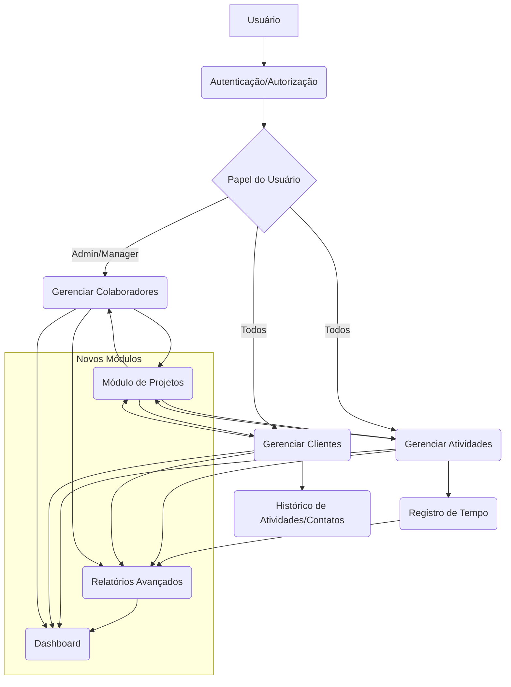

# Plano de Desenvolvimento - Activity Logbook Hub

Este documento detalha o plano para adicionar novas funcionalidades e implementar melhorias no projeto Activity Logbook Hub, com base na análise do código existente e nos objetivos do projeto (rastrear tempo gasto em projetos por colaboradores, gerenciar interações com clientes/vendas e monitorar tarefas internas/progresso).

## Proposta de Funcionalidades

As seguintes funcionalidades são propostas para enriquecer o sistema, alinhadas com seus objetivos principais:

1.  **Módulo de Projetos:**
    *   **Descrição:** Introduzir uma nova entidade para agrupar atividades relacionadas. Isso permitirá uma organização mais clara do trabalho e facilitará o rastreamento e relatórios por projeto.
    *   **Impacto:** Melhora a organização, permite relatórios mais granulares por projeto.

2.  **Registro de Tempo em Atividades:**
    *   **Descrição:** Adicionar a capacidade para colaboradores registrarem o tempo dedicado a cada atividade. Esta é uma funcionalidade central para atender ao objetivo de rastreamento de tempo.
    *   **Impacto:** Permite o cálculo preciso do tempo gasto, essencial para faturamento, análise de produtividade e gestão de recursos.

3.  **Relatórios Avançados:**
    *   **Descrição:** Desenvolver a seção de relatórios pendente para fornecer visões agregadas e personalizáveis dos dados.
    *   **Impacto:** Oferece insights valiosos sobre o tempo gasto, progresso das atividades, desempenho de colaboradores e interações com clientes.

4.  **Dashboard Inicial:**
    *   **Descrição:** Criar uma página inicial que apresente um resumo visual das métricas chave do sistema.
    *   **Impacto:** Fornece uma visão geral rápida do estado atual do projeto, atividades pendentes e outras informações importantes ao fazer login.

## Proposta de Melhorias

Além das funcionalidades, algumas melhorias técnicas são sugeridas para otimizar o projeto a longo prazo:

1.  **Otimização da Busca e Filtragem:**
    *   **Descrição:** Avaliar a viabilidade de mover a lógica de busca e filtragem (atualmente no frontend) para o backend (Firebase).
    *   **Impacto:** Melhora a performance da aplicação, especialmente com um grande volume de dados.

2.  **Refatoração da Lógica de Filtros de Atividades:**
    *   **Descrição:** Simplificar a gestão dos múltiplos estados de filtro na página de atividades, possivelmente utilizando `useReducer`.
    *   **Impacto:** Torna o código mais legível, fácil de manter e menos propenso a erros.

3.  **Validação de Formulários:**
    *   **Descrição:** Implementar validação consistente em todos os formulários de criação/edição (Atividades, Clientes, Colaboradores, Projetos).
    *   **Impacto:** Garante a integridade e qualidade dos dados inseridos no sistema.

## Plano Detalhado de Implementação (Foco nas Funcionalidades)

O plano a seguir detalha os passos para implementar as funcionalidades propostas, priorizando-as com base nos objetivos do projeto:

1.  **Implementação do Módulo de Projetos:**
    *   **Estrutura de Dados no Firebase:**
        *   Criar uma nova coleção/nó `projects` no Firebase Realtime Database.
        *   Cada projeto deve ter campos como: `id` (gerado automaticamente), `name` (string, obrigatório), `description` (string, opcional), `clientId` (string, opcional, referência ao cliente associado), `startDate` (string, formato ISO), `endDate` (string, formato ISO, opcional), `status` (string, ex: 'active', 'completed', 'archived', 'cancelled'), `assignedCollaborators` (array de strings, UIDs dos colaboradores envolvidos), `createdAt` (string, formato ISO), `updatedAt` (string, formato ISO).
    *   **Desenvolvimento das Páginas (React/TypeScript):**
        *   Criar a pasta `src/pages/projects`.
        *   Desenvolver `ProjectsPage.tsx` para listar projetos, com funcionalidades de busca, filtragem (por status, cliente, colaborador) e paginação, similar às páginas existentes.
        *   Desenvolver `NewProjectPage.tsx` com um formulário para criar novos projetos. Incluir campos para nome, descrição, seleção de cliente (usando os dados de clientes existentes), seleção de colaboradores (usando os dados de colaboradores existentes), datas e status inicial.
        *   Desenvolver `ProjectDetailsPage.tsx` para exibir os detalhes de um projeto específico. Incluir informações do projeto, o cliente associado, os colaboradores envolvidos e uma lista das atividades associadas a este projeto.
        *   Desenvolver `EditProjectPage.tsx` com um formulário pré-preenchido para editar projetos existentes.
    *   **Lógica de Integração com Firebase:**
        *   Criar um novo arquivo de serviço, ex: `src/services/firebase/projects.ts`.
        *   Implementar funções assíncronas para: `getProjects()`, `getProjectById(id)`, `createProject(data)`, `updateProject(id, data)`, `deleteProject(id)` (ou `deactivateProject`).
    *   **Atualização da Estrutura de Atividades:**
        *   Modificar a interface `Activity` (provavelmente em `src/services/firebase/activities.ts`) para incluir `projectId?: string;`.
        *   Atualizar as funções de criação/edição de atividades para salvar o `projectId` quando um projeto for selecionado.
    *   **Integração nas Páginas Existentes:**
        *   Na página `ActivitiesPage.tsx`, adicionar um filtro por Projeto e exibir o nome do projeto associado a cada atividade.
        *   Na página `ClientDetailsPage.tsx`, buscar e listar os projetos onde o cliente está associado.
        *   Na página `CollaboratorDetailsPage.tsx`, buscar e listar os projetos onde o colaborador está envolvido.
    *   **Atualização do Roteamento:**
        *   Adicionar as novas rotas para as páginas de projetos em `src/App.tsx`.
        *   Adicionar links de navegação para a página de Projetos no sidebar (`src/components/layout/MainSidebar.tsx`).

2.  **Implementação do Registro de Tempo em Atividades:**
    *   **Estrutura de Dados no Firebase:**
        *   Modificar a estrutura de dados de Atividades no Firebase para incluir campos como `timeSpent?: number;` (para armazenar o tempo em uma unidade base, ex: minutos) e `timeUnit?: 'minutes' | 'hours';` (para indicar a unidade, se necessário, embora armazenar em minutos seja mais simples para agregação).
    *   **Modificação do Formulário de Edição de Atividades:**
        *   No formulário de edição de atividades (`src/pages/activities/EditActivityPage.tsx`), adicionar campos de input (numérico) para permitir que o usuário insira o tempo gasto.
        *   Validar a entrada do usuário para garantir que seja um número válido.
        *   Atualizar a função de `updateActivity` para salvar o tempo registrado no Firebase.
    *   **(Opcional) Componente de Cronômetro:**
        *   Criar um novo componente React, ex: `ActivityTimer.tsx`.
        *   Este componente teria botões "Iniciar", "Parar" e "Resetar".
        *   Ao iniciar, ele registraria o tempo. Ao parar, calcularia a duração e a adicionaria ao campo `timeSpent` da atividade correspondente no Firebase.
        *   Integrar este componente na página de detalhes da atividade (`ActivityDetailsPage.tsx`).

3.  **Desenvolvimento dos Relatórios Avançados:**
    *   **Página de Relatórios (`src/pages/ReportsPage.tsx`):**
        *   Criar a pasta `src/pages/reports` e o arquivo `ReportsPage.tsx`.
        *   Desenvolver a interface de usuário com seletores de filtro para: Período de Data (usando o componente `Calendar`), Cliente (usando `Combobox` com dados de clientes), Projeto (usando `Combobox` com dados de projetos), Colaborador (usando `Combobox` com dados de colaboradores), Status da Atividade (checkboxes), Tipo de Atividade (checkboxes/combobox).
        *   Adicionar um botão "Gerar Relatório".
    *   **Lógica de Busca e Agregação:**
        *   Ao clicar em "Gerar Relatório", buscar as atividades do Firebase que correspondem aos filtros selecionados.
        *   Implementar a lógica para agregar os dados. Exemplos:
            *   Calcular o tempo total gasto por cliente/projeto/colaborador no período.
            *   Contar atividades por status/tipo/projeto/cliente/colaborador no período.
        *   Considerar a otimização: se a busca/filtragem no backend for implementada, utilizar as funções de serviço correspondentes. Caso contrário, buscar todos os dados relevantes e filtrar/agregar no frontend.
    *   **Exibição dos Resultados:**
        *   Exibir os resultados agregados em tabelas claras e formatadas.
        *   (Opcional) Integrar uma biblioteca de gráficos (ex: Chart.js, Recharts) para visualizações simples (gráficos de barra para tempo por categoria, gráficos de pizza para status).
    *   **Funcionalidade de Exportação:**
        *   Aprimorar a função `exportActivitiesToExcel` em `src/utils/exportUtils.ts` para aceitar a lista de atividades filtradas e agregadas dos relatórios.
        *   Adicionar opções de exportação para CSV.
        *   Explorar a geração de PDF utilizando o componente `PdfReportTemplate.tsx` existente, adaptando-o para os diferentes formatos de relatório.

4.  **Criação do Dashboard:**
    *   **Modificação da Página Inicial (`src/pages/Index.tsx`):**
        *   Renomear `Index.tsx` para `DashboardPage.tsx` (ou manter o nome, mas mudar o conteúdo).
        *   Remover o conteúdo placeholder atual.
    *   **Desenvolvimento de Widgets:**
        *   Criar componentes React menores (widgets) para exibir informações específicas. Exemplos:
            *   `ActivityStatusWidget.tsx`: Exibe a contagem de atividades por status com ícones e cores.
            *   `TimeSummaryWidget.tsx`: Exibe o tempo total registrado em um período configurável (ex: "Esta Semana", "Este Mês").
            *   `RecentActivitiesWidget.tsx`: Lista as N atividades mais recentes do usuário logado ou da equipe (para managers/admins).
            *   `ProjectSummaryWidget.tsx`: Exibe um resumo dos projetos (ex: número de projetos ativos, projetos próximos do prazo).
        *   Posicionar esses widgets na página do Dashboard usando um layout responsivo (ex: grid ou flexbox).
    *   **Lógica de Busca de Dados para Widgets:**
        *   Implementar a lógica para buscar os dados necessários para cada widget do Firebase. Isso pode envolver a busca de atividades, projetos, etc., com filtros apropriados.
        *   Considerar a performance: buscar apenas os dados essenciais para cada widget.

## Diagrama de Relacionamento (Simplificado)

Este plano detalhado serve como um guia para as próximas etapas de desenvolvimento.