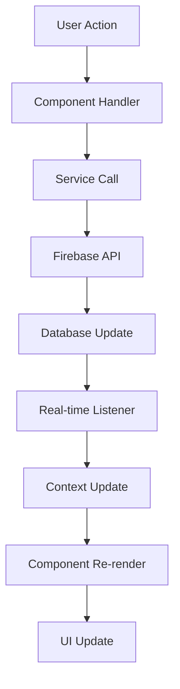
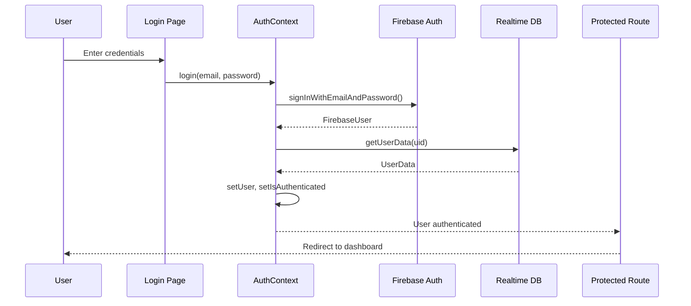
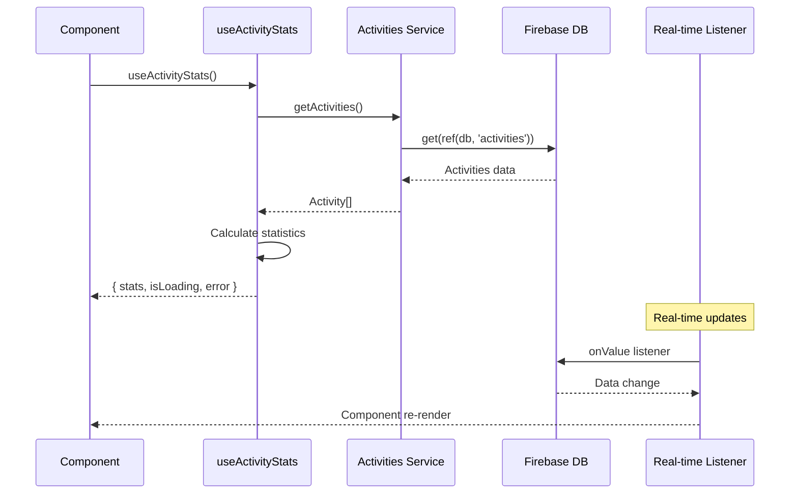

# Documentação Técnica - Activity Logbook Hub

## 📋 Índice

1. [Arquitetura do Sistema](#arquitetura-do-sistema)
2. [Padrões Arquiteturais](#padrões-arquiteturais)
3. [Camada de Serviços Firebase](#camada-de-serviços-firebase)
4. [Sistema de Autenticação e Autorização](#sistema-de-autenticação-e-autorização)
5. [Gerenciamento de Estado](#gerenciamento-de-estado)
6. [Hooks Customizados](#hooks-customizados)
7. [Sistema de Exportação](#sistema-de-exportação)
8. [Componentes de UI](#componentes-de-ui)
9. [Utilitários e Helpers](#utilitários-e-helpers)
10. [Fluxo de Dados](#fluxo-de-dados)
11. [Performance e Otimizações](#performance-e-otimizações)
12. [Padrões de Código](#padrões-de-código)

---

## 🏗️ Arquitetura do Sistema

### Visão Geral da Arquitetura

O sistema segue uma arquitetura **Cliente-Servidor** baseada em **Single Page Application (SPA)** com as seguintes camadas:

```
┌─────────────────────────────────────────────────────────────┐
│                    PRESENTATION LAYER                       │
│  ┌─────────────┐  ┌─────────────┐  ┌─────────────────────┐  │
│  │   Pages     │  │ Components  │  │    UI Components    │  │
│  │             │  │             │  │    (Shadcn/ui)      │  │
│  └─────────────┘  └─────────────┘  └─────────────────────┘  │
└─────────────────────────────────────────────────────────────┘
┌─────────────────────────────────────────────────────────────┐
│                     BUSINESS LAYER                          │
│  ┌─────────────┐  ┌─────────────┐  ┌─────────────────────┐  │
│  │   Hooks     │  │  Contexts   │  │     Services        │  │
│  │             │  │             │  │                     │  │
│  └─────────────┘  └─────────────┘  └─────────────────────┘  │
└─────────────────────────────────────────────────────────────┘
┌─────────────────────────────────────────────────────────────┐
│                      DATA LAYER                             │
│  ┌─────────────┐  ┌─────────────┐  ┌─────────────────────┐  │
│  │  Firebase   │  │  Realtime   │  │    Authentication   │  │
│  │   Config    │  │  Database   │  │      Service        │  │
│  └─────────────┘  └─────────────┘  └─────────────────────┘  │
└─────────────────────────────────────────────────────────────┘
```

### Stack Tecnológica Detalhada

#### Frontend Core
- **React 18.3.1**: Framework principal com Concurrent Features
- **TypeScript 5.5.3**: Tipagem estática e IntelliSense
- **Vite 5.4.1**: Build tool com Hot Module Replacement (HMR)
- **React Router DOM 6.26.2**: Roteamento declarativo

#### Gerenciamento de Estado
- **React Context API**: Estado global (Auth, Theme)
- **useState/useReducer**: Estado local dos componentes
- **Custom Hooks**: Lógica reutilizável e estado compartilhado

#### UI e Styling
- **Tailwind CSS 3.4.11**: Utility-first CSS framework
- **Shadcn/ui**: Componentes baseados em Radix UI
- **Lucide React**: Biblioteca de ícones SVG
- **Recharts**: Biblioteca de gráficos responsivos

---

## 🎨 Padrões Arquiteturais

### 1. **Compound Component Pattern**

Usado nos componentes de UI complexos:

```typescript
// Exemplo: Card compound component
<Card>
  <CardHeader>
    <CardTitle>Título</CardTitle>
    <CardDescription>Descrição</CardDescription>
  </CardHeader>
  <CardContent>
    {/* Conteúdo */}
  </CardContent>
  <CardFooter>
    {/* Ações */}
  </CardFooter>
</Card>
```

### 2. **Provider Pattern**

Gerenciamento de estado global:

```typescript
// AuthProvider implementação
export const AuthProvider = ({ children }: { children: ReactNode }) => {
  const [user, setUser] = useState<User>(null);
  const [isAuthenticated, setIsAuthenticated] = useState(false);
  
  // Lógica de autenticação...
  
  return (
    <AuthContext.Provider value={{ user, login, logout, isAuthenticated }}>
      {children}
    </AuthContext.Provider>
  );
};
```

### 3. **Custom Hooks Pattern**

Encapsulamento de lógica complexa:

```typescript
// Hook para estatísticas de atividades
export const useActivityStats = () => {
  const [stats, setStats] = useState<ActivityStats>();
  const [isLoading, setIsLoading] = useState(true);
  const [error, setError] = useState<Error | null>(null);
  
  // Lógica de cálculo e fetch...
  
  return { stats, isLoading, error };
};
```

### 4. **Repository Pattern**

Abstração do acesso a dados:

```typescript
// activities.ts - Repository para atividades
export const getActivities = async (): Promise<Activity[]> => {
  // Implementação Firebase
};

export const createActivity = async (activity: Omit<Activity, 'id'>): Promise<string> => {
  // Implementação Firebase
};
```

---

## 🔥 Camada de Serviços Firebase

### Configuração e Inicialização

```typescript
// src/lib/firebase.ts
import { initializeApp } from 'firebase/app';
import { getAuth } from 'firebase/auth';
import { getDatabase } from 'firebase/database';

const firebaseConfig = {
  // Configurações do projeto
};

const app = initializeApp(firebaseConfig);
export const auth = getAuth(app);
export const db = getDatabase(app);
```

### Serviço de Autenticação

#### Estrutura de Tipos
```typescript
export type UserRole = 'admin' | 'manager' | 'collaborator';
export type CollaboratorStatus = 'active' | 'inactive' | 'pending';

export interface UserData {
  name: string;
  role: UserRole;
  email: string;
  cpf: string;
  phone: string;
  birthDate: string;
  admissionDate: string;
  active: boolean;
  status?: CollaboratorStatus;
  photoURL?: string;
  createdAt?: string;
  updatedAt?: string;
  uid?: string;
}
```

#### Métodos Principais

**Criação de Usuário**
```typescript
export const createUser = async (
  email: string, 
  password: string, 
  userData: Omit<UserData, 'email'>
) => {
  try {
    // 1. Criar usuário no Firebase Authentication
    const userCredential = await createUserWithEmailAndPassword(auth, email, password);
    const user = userCredential.user;
    
    // 2. Atualizar perfil
    await updateProfile(user, { displayName: userData.name });
    
    // 3. Salvar dados adicionais no Realtime Database
    await set(ref(db, `users/${user.uid}`), {
      ...userData,
      email,
      uid: user.uid,
      createdAt: new Date().toISOString(),
      updatedAt: new Date().toISOString()
    });
    
    return user;
  } catch (error) {
    console.error('Erro ao criar usuário:', error);
    throw error;
  }
};
```

**Autenticação**
```typescript
export const signIn = async (email: string, password: string): Promise<FirebaseUser> => {
  try {
    const userCredential = await signInWithEmailAndPassword(auth, email, password);
    return userCredential.user;
  } catch (error) {
    console.error('Erro ao fazer login:', error);
    throw error;
  }
};
```

### Serviço de Atividades

#### Estrutura de Dados
```typescript
export type ActivityStatus = 'pending' | 'in-progress' | 'completed' | 'cancelled';
export type ActivityPriority = 'low' | 'medium' | 'high';

export interface Activity {
  id: string;
  title: string;
  description: string;
  clientId: string;
  assignedTo: string[];
  status: ActivityStatus;
  priority: ActivityPriority;
  startDate: string;
  endDate: string;
  completedDate?: string;
  createdAt: string;
  updatedAt: string;
  createdBy: string;
  type?: string;
}
```

#### Operações CRUD

**Buscar Atividades**
```typescript
export const getActivities = async (): Promise<Activity[]> => {
  try {
    const activitiesRef = ref(db, 'activities');
    const snapshot = await get(activitiesRef);
    
    if (snapshot.exists()) {
      const activitiesData = snapshot.val();
      return Object.keys(activitiesData).map(key => ({
        ...activitiesData[key],
        id: key
      }));
    }
    
    return [];
  } catch (error) {
    console.error('Erro ao buscar atividades:', error);
    throw error;
  }
};
```

**Criar Atividade**
```typescript
export const createActivity = async (activity: Omit<Activity, 'id' | 'createdAt' | 'updatedAt'>): Promise<string> => {
  try {
    const activitiesRef = ref(db, 'activities');
    const newActivityRef = push(activitiesRef);
    
    const activityData = {
      ...activity,
      id: newActivityRef.key!,
      createdAt: new Date().toISOString(),
      updatedAt: new Date().toISOString()
    };
    
    await set(newActivityRef, activityData);
    return newActivityRef.key!;
  } catch (error) {
    console.error('Erro ao criar atividade:', error);
    throw error;
  }
};
```

### Serviço de Clientes

#### Sistema de Tipos Polimórficos
```typescript
export type ClientType = 'fisica' | 'juridica';

export interface BaseClient {
  id: string;
  name: string;
  type: ClientType;
  email?: string;
  phone?: string;
  address?: string;
  active: boolean;
  createdAt: string;
  updatedAt: string;
  createdBy: string;
}

export interface PessoaFisicaClient extends BaseClient {
  type: 'fisica';
  cpf?: string;
  rg?: string;
}

export interface PessoaJuridicaClient extends BaseClient {
  type: 'juridica';
  companyName: string;
  cnpj?: string;
  responsibleName?: string;
}

export type Client = PessoaFisicaClient | PessoaJuridicaClient;
```

---

## 🔐 Sistema de Autenticação e Autorização

### Context de Autenticação

#### Estado do Contexto
```typescript
type User = {
  uid: string;
  name: string;
  role: UserRole;
  email: string;
} | null;

type AuthContextType = {
  user: User;
  login: (email: string, password: string) => Promise<boolean>;
  logout: () => void;
  isAuthenticated: boolean;
  isLoading: boolean;
  isAdmin: boolean;
  hasPermission: (roles: UserRole[]) => boolean;
};
```

#### Fluxo de Autenticação
```typescript
export const AuthProvider = ({ children }: { children: ReactNode }) => {
  const [user, setUser] = useState<User>(null);
  const [isAuthenticated, setIsAuthenticated] = useState(false);
  const [isLoading, setIsLoading] = useState(true);
  const [isAdmin, setIsAdmin] = useState(false);

  // Função para verificar permissões
  const hasPermission = (allowedRoles: UserRole[]) => {
    if (!user) return false;
    return allowedRoles.includes(user.role);
  };

  // Listener para mudanças de autenticação
  useEffect(() => {
    const unsubscribe = onAuthStateChanged(auth, async (firebaseUser) => {
      if (firebaseUser) {
        try {
          const userData = await getUserData(firebaseUser.uid);
          
          if (userData) {
            setUser({
              uid: firebaseUser.uid,
              name: userData.name,
              role: userData.role,
              email: userData.email
            });
            setIsAuthenticated(true);
            setIsAdmin(userData.role === 'admin');
          }
        } catch (error) {
          console.error("Erro ao obter dados do usuário:", error);
          // Reset estado em caso de erro
        }
      } else {
        // Reset estado quando não autenticado
        setUser(null);
        setIsAuthenticated(false);
        setIsAdmin(false);
      }
      setIsLoading(false);
    });

    return () => unsubscribe();
  }, []);
};
```

### Componente de Rota Protegida

```typescript
type ProtectedRouteProps = {
  children: React.ReactNode;
  allowedRoles?: UserRole[];
};

const ProtectedRoute = ({ children, allowedRoles }: ProtectedRouteProps) => {
  const { isAuthenticated, hasPermission } = useAuth();
  const location = useLocation();

  // Verificação de autenticação
  if (!isAuthenticated) {
    return <Navigate to="/login" state={{ from: location }} replace />;
  }

  // Verificação de autorização por role
  if (allowedRoles && !hasPermission(allowedRoles)) {
    return <Navigate to="/unauthorized" replace />;
  }

  return <>{children}</>;
};
```

### Sistema de Permissões

#### Matriz de Permissões
| Funcionalidade | Admin | Manager | Collaborator |
|----------------|-------|---------|--------------|
| Dashboard Completo | ✅ | ✅ | ❌ |
| CRUD Atividades | ✅ | ✅ | ✅* |
| CRUD Clientes | ✅ | ✅ | ✅ |
| CRUD Colaboradores | ✅ | ✅ | ❌ |
| Relatórios/Exportação | ✅ | ✅ | ❌ |
| Configurações Sistema | ✅ | ❌ | ❌ |

*Colaboradores veem apenas atividades atribuídas a eles

---

## 🗄️ Gerenciamento de Estado

### Context API Pattern

#### AuthContext - Estado de Autenticação
```typescript
// Estado global de autenticação
const AuthContext = createContext<AuthContextType | undefined>(undefined);

// Hook personalizado para usar o contexto
export const useAuth = () => {
  const context = useContext(AuthContext);
  if (context === undefined) {
    throw new Error("useAuth deve ser usado dentro de um AuthProvider");
  }
  return context;
};
```

#### ThemeContext - Sistema de Temas
```typescript
type Theme = "light" | "dark" | "h12" | "h12-alt";

interface ThemeContextType {
  theme: Theme;
  toggleTheme: () => void;
}

export function ThemeProvider({ children }: { children: React.ReactNode }) {
  const [theme, setTheme] = useState<Theme>(() => {
    const savedTheme = localStorage.getItem("theme") as Theme;
    // Validação e fallback para tema padrão
    if (savedTheme && ["light", "dark", "h12", "h12-alt"].includes(savedTheme)) {
      return savedTheme;
    }
    
    return window.matchMedia("(prefers-color-scheme: dark)").matches 
      ? "dark" 
      : "light";
  });

  const toggleTheme = () => {
    setTheme((prevTheme) => {
      // Ciclo entre os 4 temas disponíveis
      if (prevTheme === "light") return "dark";
      if (prevTheme === "dark") return "h12";
      if (prevTheme === "h12") return "h12-alt";
      return "light";
    });
  };

  useEffect(() => {
    localStorage.setItem("theme", theme);
    
    // Aplicar classes CSS correspondentes
    document.documentElement.classList.remove("dark", "h12", "h12-alt");
    
    if (theme === "dark") {
      document.documentElement.classList.add("dark");
    } else if (theme === "h12") {
      document.documentElement.classList.add("h12");
    } else if (theme === "h12-alt") {
      document.documentElement.classList.add("h12-alt");
    }
  }, [theme]);
}
```

### Sistema de Toast (useToast)

#### Implementação com useReducer
```typescript
type State = {
  toasts: ToasterToast[]
}

type Action =
  | { type: "ADD_TOAST"; toast: ToasterToast }
  | { type: "UPDATE_TOAST"; toast: Partial<ToasterToast> }
  | { type: "DISMISS_TOAST"; toastId?: string }
  | { type: "REMOVE_TOAST"; toastId?: string }

export const reducer = (state: State, action: Action): State => {
  switch (action.type) {
    case "ADD_TOAST":
      return {
        ...state,
        toasts: [action.toast, ...state.toasts].slice(0, TOAST_LIMIT),
      }

    case "UPDATE_TOAST":
      return {
        ...state,
        toasts: state.toasts.map((t) =>
          t.id === action.toast.id ? { ...t, ...action.toast } : t
        ),
      }

    case "DISMISS_TOAST": {
      const { toastId } = action
      
      if (toastId) {
        addToRemoveQueue(toastId)
      } else {
        state.toasts.forEach((toast) => {
          addToRemoveQueue(toast.id)
        })
      }

      return {
        ...state,
        toasts: state.toasts.map((t) =>
          t.id === toastId || toastId === undefined
            ? { ...t, open: false }
            : t
        ),
      }
    }
    
    case "REMOVE_TOAST":
      if (action.toastId === undefined) {
        return { ...state, toasts: [] }
      }
      return {
        ...state,
        toasts: state.toasts.filter((t) => t.id !== action.toastId),
      }
  }
}

// Estado global em memória
let memoryState: State = { toasts: [] }

// Sistema de listeners para componentes
const listeners: Array<(state: State) => void> = []

function dispatch(action: Action) {
  memoryState = reducer(memoryState, action)
  listeners.forEach((listener) => {
    listener(memoryState)
  })
}
```

---

## 🪝 Hooks Customizados

### useActivityStats - Estatísticas de Atividades

#### Interface e Tipos
```typescript
export type ActivityStats = {
  total: number;
  completed: number;
  inProgress: number;
  future: number;
  pending: number;
  cancelled: number;
  overdue: number;
};
```

#### Implementação Completa
```typescript
export const useActivityStats = () => {
  const [isLoading, setIsLoading] = useState(true);
  const [error, setError] = useState<Error | null>(null);
  const [stats, setStats] = useState<{
    today: ActivityStats;
    week: ActivityStats;
    month: ActivityStats;
    all: ActivityStats;
  }>({
    today: { total: 0, completed: 0, inProgress: 0, future: 0, pending: 0, cancelled: 0, overdue: 0 },
    week: { total: 0, completed: 0, inProgress: 0, future: 0, pending: 0, cancelled: 0, overdue: 0 },
    month: { total: 0, completed: 0, inProgress: 0, future: 0, pending: 0, cancelled: 0, overdue: 0 },
    all: { total: 0, completed: 0, inProgress: 0, future: 0, pending: 0, cancelled: 0, overdue: 0 },
  });

  // Função para determinar se uma atividade é futura
  const isFutureActivity = (activity: Activity): boolean => {
    if (!activity.startDate) return false;
    try {
      const startDate = startOfDay(new Date(activity.startDate));
      const today = startOfDay(new Date());
      return isAfter(startDate, today);
    } catch (e) {
      console.error("Erro ao processar data de início para atividade futura:", activity.startDate, e);
      return false;
    }
  };

  // Função para determinar se uma atividade está atrasada
  const isOverdueActivity = (activity: Activity): boolean => {
    if (!activity.endDate || activity.status === 'completed' || activity.status === 'cancelled') {
      return false;
    }
    try {
      const endDate = startOfDay(new Date(activity.endDate));
      const today = startOfDay(new Date());
      return isBefore(endDate, today) && (activity.status === 'pending' || activity.status === 'in-progress');
    } catch (e) {
      console.error("Erro ao processar data de fim para atividade atrasada:", activity.endDate, e);
      return false;
    }
  };

  // Lógica principal de cálculo de estatísticas
  useEffect(() => {
    const fetchStats = async () => {
      try {
        setIsLoading(true);
        const activities = await getActivities();
        
        const today = startOfToday();
        const weekStart = startOfWeek(today, { weekStartsOn: 1 });
        const weekEnd = endOfWeek(today, { weekStartsOn: 1 });
        const monthStart = startOfMonth(today);
        const monthEnd = endOfMonth(today);

        // Calcular estatísticas para cada período
        const calculateStats = (filteredActivities: Activity[]): ActivityStats => {
          return filteredActivities.reduce((acc, activity) => {
            acc.total++;
            
            if (activity.status === 'completed') acc.completed++;
            else if (activity.status === 'in-progress') acc.inProgress++;
            else if (activity.status === 'cancelled') acc.cancelled++;
            else if (activity.status === 'pending') {
              if (isFutureActivity(activity)) acc.future++;
              else acc.pending++;
            }
            
            if (isOverdueActivity(activity)) acc.overdue++;
            
            return acc;
          }, { total: 0, completed: 0, inProgress: 0, future: 0, pending: 0, cancelled: 0, overdue: 0 });
        };

        // Filtrar atividades por período
        const todayActivities = activities.filter(activity => 
          activityOverlapsPeriod(activity, today, today)
        );
        
        const weekActivities = activities.filter(activity => 
          activityOverlapsPeriod(activity, weekStart, weekEnd)
        );
        
        const monthActivities = activities.filter(activity => 
          activityOverlapsPeriod(activity, monthStart, monthEnd)
        );

        setStats({
          today: calculateStats(todayActivities),
          week: calculateStats(weekActivities),
          month: calculateStats(monthActivities),
          all: calculateStats(activities)
        });
        
      } catch (err) {
        console.error('Erro ao buscar estatísticas:', err);
        setError(err as Error);
      } finally {
        setIsLoading(false);
      }
    };

    fetchStats();
  }, []);

  return { stats, isLoading, error };
};
```

### useIsMobile - Detecção de Dispositivo Móvel

```typescript
const MOBILE_BREAKPOINT = 768

export function useIsMobile() {
  const [isMobile, setIsMobile] = React.useState<boolean | undefined>(undefined)

  React.useEffect(() => {
    const mql = window.matchMedia(`(max-width: ${MOBILE_BREAKPOINT - 1}px)`)
    const onChange = () => {
      setIsMobile(window.innerWidth < MOBILE_BREAKPOINT)
    }
    
    // Adicionar listener
    mql.addEventListener("change", onChange)
    
    // Verificação inicial
    setIsMobile(window.innerWidth < MOBILE_BREAKPOINT)
    
    // Cleanup
    return () => mql.removeEventListener("change", onChange)
  }, [])

  return !!isMobile
}
```

---

## 📊 Sistema de Exportação

### Arquitetura do Sistema de Exportação

O sistema de exportação implementa duas estratégias principais:

1. **XLSX Básico**: Usando a biblioteca `xlsx` para compatibilidade
2. **ExcelJS Avançado**: Carregamento dinâmico via CDN para recursos avançados

### Implementação XLSX Básica

#### Função Principal de Exportação
```typescript
export const exportActivitiesToExcel = (
  activities: (Activity & { clientName?: string })[],
  filename = 'atividades.xlsx',
  assignees: Record<string, string> = {}
) => {
  // Converter dados para formato Excel
  const dataForSheet = activities.map(activity => ({
    'Título': activity.title,
    'Descrição': activity.description,
    'Cliente': activity.clientName || activity.clientId || 'N/A',
    'Responsáveis': activity.assignedTo && activity.assignedTo.length > 0
      ? activity.assignedTo
          .map(id => assignees[id] || id)
          .join(', ')
      : 'Ninguém atribuído',
    'Status': getActivityStatusText(activity.status),
    'Prioridade': getActivityPriorityText(activity.priority),
    'Data de Início': toExcelDate(activity.startDate),
    'Data de Término': toExcelDate(activity.endDate),
    'Data de Conclusão': toExcelDate(activity.completedDate),
    'Criado em': toExcelDate(activity.createdAt),
    'Atualizado em': toExcelDate(activity.updatedAt)
  }));

  // Criar worksheet com ordem específica de colunas
  const headerOrder = [
    'Título', 'Descrição', 'Cliente', 'Responsáveis', 'Status',
    'Prioridade', 'Data de Início', 'Data de Término', 'Data de Conclusão',
    'Criado em', 'Atualizado em'
  ];

  const worksheet = XLSX.utils.json_to_sheet(dataForSheet, { header: headerOrder });

  // Aplicar título e estilos
  addTitleToSheet(worksheet, "RELATÓRIO DE ATIVIDADES - ACTIVITY HUB");
  applyCellStyles(worksheet, {
    headerRowIndex: 2,
    zebra: true,
    autofilter: true,
    freezeRows: 3
  });

  // Criar workbook e salvar
  const workbook = XLSX.utils.book_new();
  XLSX.utils.book_append_sheet(workbook, worksheet, 'Atividades');
  XLSX.writeFile(workbook, filename);
};
```

#### Sistema de Estilos Avançado
```typescript
const applyCellStyles = (
  worksheet: XLSX.WorkSheet,
  opts?: {
    headerRowIndex?: number;
    zebra?: boolean;
    autofilter?: boolean;
    freezeRows?: number;
    palette?: {
      headerFill?: string;
      zebraFill?: string;
      border?: string;
    }
  }
) => {
  if (!worksheet['!ref']) return;
  
  const headerRowIndex = opts?.headerRowIndex ?? 2;
  const palette = {
    headerFill: opts?.palette?.headerFill || 'FFE8EEF7',
    zebraFill: opts?.palette?.zebraFill || 'FFF7F9FC',
    border: opts?.palette?.border || 'FFDDDDDD'
  };

  // Calcular larguras dinâmicas das colunas
  const range = XLSX.utils.decode_range(worksheet['!ref']);
  const colWidths: { width: number }[] = [];
  
  for (let C = range.s.c; C <= range.e.c; ++C) {
    let maxLen = 10;
    for (let R = range.s.r; R <= range.e.r; ++R) {
      const cellRef = XLSX.utils.encode_cell({ c: C, r: R });
      const cell = worksheet[cellRef];
      if (!cell || cell.v === undefined || cell.v === null) continue;
      const text = String(cell.v);
      maxLen = Math.max(maxLen, text.length);
    }
    const width = Math.min(Math.max(maxLen + 2, 12), 50);
    colWidths[C] = { width };
  }
  worksheet['!cols'] = colWidths;

  // Aplicar estilos de célula
  const headerStyle = {
    font: { bold: true },
    alignment: { horizontal: 'center', vertical: 'center' },
    fill: { fgColor: { rgb: palette.headerFill } }
  };

  const borderStyle = {
    top: { style: 'thin', color: { rgb: palette.border } },
    bottom: { style: 'thin', color: { rgb: palette.border } },
    left: { style: 'thin', color: { rgb: palette.border } },
    right: { style: 'thin', color: { rgb: palette.border } }
  };

  // Aplicar estilos em todas as células
  for (let R = range.s.r; R <= range.e.r; ++R) {
    for (let C = range.s.c; C <= range.e.c; ++C) {
      const cellRef = XLSX.utils.encode_cell({ c: C, r: R });
      const cell = worksheet[cellRef];
      if (!cell) continue;
      if (!cell.s) cell.s = {} as any;

      if (R === headerRowIndex) {
        Object.assign(cell.s, headerStyle);
        (cell.s as any).border = borderStyle;
      } else if (R > headerRowIndex) {
        (cell.s as any).border = borderStyle;
        (cell.s as any).alignment = { vertical: 'center', wrapText: true };
      }
    }
  }

  // Aplicar zebra stripes
  if (opts?.zebra) {
    for (let R = headerRowIndex + 1; R <= range.e.r; ++R) {
      if ((R - headerRowIndex) % 2 === 0) {
        for (let C = range.s.c; C <= range.e.c; ++C) {
          const cellRef = XLSX.utils.encode_cell({ c: C, r: R });
          const cell = worksheet[cellRef];
          if (!cell) continue;
          if (!cell.s) cell.s = {} as any;
          (cell.s as any).fill = { fgColor: { rgb: palette.zebraFill } };
        }
      }
    }
  }

  // Configurar AutoFilter
  if (opts?.autofilter) {
    const startRef = XLSX.utils.encode_cell({ c: range.s.c, r: headerRowIndex });
    const endRef = XLSX.utils.encode_cell({ c: range.e.c, r: range.e.r });
    (worksheet as any)['!autofilter'] = { ref: `${startRef}:${endRef}` };
  }

  // Congelar painéis
  if (opts?.freezeRows && opts.freezeRows > 0) {
    (worksheet as any)['!freeze'] = { rows: opts.freezeRows, columns: 0 };
  }
};
```

### Implementação ExcelJS Avançada

#### Carregamento Dinâmico de Bibliotecas
```typescript
// Utilitário para carregar scripts de CDN
const loadScript = (url: string) => new Promise<void>((resolve, reject) => {
  if (typeof document === 'undefined') return reject(new Error('Ambiente sem DOM'));
  
  const existing = document.querySelector(`script[src="${url}"]`) as HTMLScriptElement | null;
  if (existing) return resolve();
  
  const s = document.createElement('script');
  s.src = url;
  s.async = true;
  s.onload = () => resolve();
  s.onerror = () => reject(new Error(`Falha ao carregar script: ${url}`));
  document.head.appendChild(s);
});

// Garantir disponibilidade das bibliotecas
const ensureExcelJsGlobals = async () => {
  const w = window as any;
  
  if (!w.ExcelJS) {
    await loadScript('https://cdn.jsdelivr.net/npm/exceljs@4.4.0/dist/exceljs.min.js');
  }
  
  if (!w.saveAs) {
    await loadScript('https://cdn.jsdelivr.net/npm/file-saver@2.0.5/dist/FileSaver.min.js');
  }
  
  if (!w.ExcelJS || !w.saveAs) {
    throw new Error('ExcelJS ou FileSaver indisponível');
  }
  
  return { 
    ExcelJS: w.ExcelJS, 
    saveAs: w.saveAs 
  } as { ExcelJS: any; saveAs: (blob: Blob, name: string) => void };
};
```

#### Implementação com ExcelJS
```typescript
export const exportActivitiesToExcelStyled = async (
  activities: (Activity & { clientName?: string })[],
  filename = 'atividades.xlsx',
  assignees: Record<string, string> = {}
) => {
  try {
    const { ExcelJS, saveAs } = await ensureExcelJsGlobals();

    const workbook = new ExcelJS.Workbook();
    const worksheet = workbook.addWorksheet('Atividades');

    const colors = {
      headerFill: 'FFE8EEF7',
      zebraFill: 'FFF7F9FC',
      border: 'DDDDDD'
    } as const;

    // Título com merge de células
    worksheet.mergeCells(1, 1, 1, 11);
    const titleCell = worksheet.getCell(1, 1);
    titleCell.value = 'RELATÓRIO DE ATIVIDADES - ACTIVITY HUB';
    titleCell.alignment = { horizontal: 'center', vertical: 'middle' };
    titleCell.font = { bold: true, size: 16 };

    // Cabeçalho com estilos avançados
    const headers = [
      'Título', 'Descrição', 'Cliente', 'Responsáveis', 'Status',
      'Prioridade', 'Data de Início', 'Data de Término', 'Data de Conclusão',
      'Criado em', 'Atualizado em'
    ];
    
    worksheet.getRow(3).values = headers;
    worksheet.getRow(3).eachCell((cell) => {
      cell.font = { bold: true };
      cell.alignment = { horizontal: 'center', vertical: 'middle', wrapText: true };
      cell.fill = { type: 'pattern', pattern: 'solid', fgColor: { argb: colors.headerFill } } as any;
      cell.border = {
        top: { style: 'thin', color: { argb: colors.border } },
        bottom: { style: 'thin', color: { argb: colors.border } },
        left: { style: 'thin', color: { argb: colors.border } },
        right: { style: 'thin', color: { argb: colors.border } }
      };
    });

    // Inserir dados com formatação
    const startRow = 4;
    activities.forEach((activity, idx) => {
      const row = worksheet.getRow(startRow + idx);
      row.values = [
        activity.title || '',
        activity.description || '',
        activity.clientName || activity.clientId || 'N/A',
        (activity.assignedTo || []).map(id => assignees[id] || id).join(', ') || 'Ninguém atribuído',
        getActivityStatusText(activity.status),
        getActivityPriorityText(activity.priority),
        activity.startDate ? new Date(activity.startDate) : undefined,
        activity.endDate ? new Date(activity.endDate) : undefined,
        activity.completedDate ? new Date(activity.completedDate) : undefined,
        activity.createdAt ? new Date(activity.createdAt) : undefined,
        activity.updatedAt ? new Date(activity.updatedAt) : undefined
      ];
      
      // Aplicar estilos de linha
      row.eachCell((cell) => {
        cell.alignment = { vertical: 'middle', wrapText: true };
        cell.border = {
          top: { style: 'thin', color: { argb: colors.border } },
          bottom: { style: 'thin', color: { argb: colors.border } },
          left: { style: 'thin', color: { argb: colors.border } },
          right: { style: 'thin', color: { argb: colors.border } }
        };
      });
      
      // Zebra stripes
      if ((idx + 1) % 2 === 0) {
        row.eachCell((cell) => {
          cell.fill = { type: 'pattern', pattern: 'solid', fgColor: { argb: colors.zebraFill } } as any;
        });
      }
    });

    // Formatação de colunas de data
    const colIndexByHeader: Record<string, number> = {};
    headers.forEach((h, i) => { colIndexByHeader[h] = i + 1; });
    
    ['Data de Início', 'Data de Término'].forEach(h => 
      worksheet.getColumn(colIndexByHeader[h]).numFmt = 'dd/mm/yyyy hh:mm'
    );
    
    ['Data de Conclusão', 'Criado em', 'Atualizado em'].forEach(h => 
      worksheet.getColumn(colIndexByHeader[h]).numFmt = 'dd/mm/yyyy'
    );

    // Larguras dinâmicas
    worksheet.columns?.forEach((col) => {
      let max = 10;
      col.eachCell({ includeEmpty: true }, (cell) => {
        const v = cell.value as any;
        const len = v ? String(v).length : 0;
        if (len > max) max = len;
      });
      col.width = Math.min(Math.max(max + 2, 12), 50);
    });

    // AutoFilter e congelamento
    worksheet.autoFilter = {
      from: { row: 3, column: 1 },
      to: { row: Math.max(3, startRow + activities.length - 1), column: headers.length }
    } as any;
    
    worksheet.views = [{ state: 'frozen', xSplit: 0, ySplit: 3 }];

    // Gerar e salvar arquivo
    const buffer = await workbook.xlsx.writeBuffer();
    const blob = new Blob([buffer], { 
      type: 'application/vnd.openxmlformats-officedocument.spreadsheetml.sheet' 
    });
    saveAs(blob, filename);
    
  } catch (err) {
    console.error('ExcelJS indisponível, usando fallback XLSX simples:', err);
    exportActivitiesToExcel(activities, filename, assignees);
  }
};
```

---

## 🎨 Componentes de UI

### Sistema de Design Baseado em Shadcn/ui

O projeto utiliza uma arquitetura de componentes baseada no **Shadcn/ui**, que combina:
- **Radix UI**: Componentes headless acessíveis
- **Tailwind CSS**: Estilização utilitária
- **Class Variance Authority (CVA)**: Variantes de componentes
- **Tailwind Merge**: Resolução de conflitos de classes

#### Estrutura de Componentes

```typescript
// Exemplo: Button Component
import { Slot } from "@radix-ui/react-slot"
import { cva, type VariantProps } from "class-variance-authority"
import { cn } from "@/lib/utils"

const buttonVariants = cva(
  "inline-flex items-center justify-center whitespace-nowrap rounded-md text-sm font-medium ring-offset-background transition-colors focus-visible:outline-none focus-visible:ring-2 focus-visible:ring-ring focus-visible:ring-offset-2 disabled:pointer-events-none disabled:opacity-50",
  {
    variants: {
      variant: {
        default: "bg-primary text-primary-foreground hover:bg-primary/90",
        destructive: "bg-destructive text-destructive-foreground hover:bg-destructive/90",
        outline: "border border-input bg-background hover:bg-accent hover:text-accent-foreground",
        secondary: "bg-secondary text-secondary-foreground hover:bg-secondary/80",
        ghost: "hover:bg-accent hover:text-accent-foreground",
        link: "text-primary underline-offset-4 hover:underline",
      },
      size: {
        default: "h-10 px-4 py-2",
        sm: "h-9 rounded-md px-3",
        lg: "h-11 rounded-md px-8",
        icon: "h-10 w-10",
      },
    },
    defaultVariants: {
      variant: "default",
      size: "default",
    },
  }
)

export interface ButtonProps
  extends React.ButtonHTMLAttributes<HTMLButtonElement>,
    VariantProps<typeof buttonVariants> {
  asChild?: boolean
}

const Button = React.forwardRef<HTMLButtonElement, ButtonProps>(
  ({ className, variant, size, asChild = false, ...props }, ref) => {
    const Comp = asChild ? Slot : "button"
    return (
      <Comp
        className={cn(buttonVariants({ variant, size, className }))}
        ref={ref}
        {...props}
      />
    )
  }
)
```

### Sistema de Temas CSS

#### Variáveis CSS Customizadas
```css
:root {
  --background: 0 0% 100%;
  --foreground: 222.2 84% 4.9%;
  --card: 0 0% 100%;
  --card-foreground: 222.2 84% 4.9%;
  --primary: 222.2 47.4% 11.2%;
  --primary-foreground: 210 40% 98%;
  /* ... outras variáveis */
}

.dark {
  --background: 222.2 84% 4.9%;
  --foreground: 210 40% 98%;
  /* ... variáveis do tema escuro */
}

.h12 {
  --background: 210 30% 98%;
  --foreground: 220 1% 39%;
  --primary: 218 59% 31%;
  /* ... variáveis do tema H12 */
}

.h12-alt {
  --background: 218 59% 31%;
  --foreground: 210 30% 98%;
  /* ... variáveis do tema H12 alternativo */
}
```

### Componentes de Layout

#### AppLayout - Layout Principal
```typescript
const AppLayout = () => {
  return (
    <div className="flex h-screen bg-background">
      <MainSidebar />
      <main className="flex-1 flex flex-col overflow-hidden">
        <div className="flex-1 overflow-auto p-6">
          <Outlet />
        </div>
      </main>
    </div>
  );
};
```

#### MainSidebar - Navegação Lateral
```typescript
const MainSidebar = () => {
  const { user, isAdmin, hasPermission } = useAuth();
  const location = useLocation();

  const menuItems = [
    { path: '/', label: 'Dashboard', icon: Home },
    { path: '/activities', label: 'Atividades', icon: Activity },
    { path: '/clients', label: 'Clientes', icon: Users },
    // Items condicionais baseados em permissões
    ...(hasPermission(['admin', 'manager']) ? [
      { path: '/home', label: 'Agenda', icon: Calendar },
      { path: '/collaborators', label: 'Colaboradores', icon: UserCheck },
    ] : [])
  ];

  return (
    <aside className="w-64 bg-sidebar-background border-r">
      <nav className="p-4">
        {menuItems.map((item) => (
          <Link
            key={item.path}
            to={item.path}
            className={cn(
              "flex items-center gap-3 px-3 py-2 rounded-lg transition-colors",
              location.pathname === item.path
                ? "sidebar-active"
                : "hover:bg-sidebar-accent"
            )}
          >
            <item.icon size={20} />
            <span>{item.label}</span>
          </Link>
        ))}
      </nav>
    </aside>
  );
};
```

---

## 🛠️ Utilitários e Helpers

### Utilitário de Classes CSS (cn)

```typescript
// src/lib/utils.ts
import { type ClassValue, clsx } from "clsx"
import { twMerge } from "tailwind-merge"

export function cn(...inputs: ClassValue[]) {
  return twMerge(clsx(inputs))
}
```

### Formatação de Dados

#### Formatação de Datas
```typescript
export const formatDate = (dateString?: string): string => {
  if (!dateString) return '';
  try {
    const date = new Date(dateString);
    if (isNaN(date.getTime())) {
      console.warn("Invalid date string received:", dateString);
      return '';
    }
    return date.toLocaleDateString('pt-BR', { timeZone: 'UTC' });
  } catch (e) {
    console.error("Error formatting date:", dateString, e);
    return '';
  }
};
```

#### Conversão de Status e Prioridades
```typescript
export const getActivityStatusText = (status: string): string => {
  switch (status) {
    case 'pending': return 'Futura';
    case 'in-progress': return 'Em Progresso';
    case 'completed': return 'Concluída';
    case 'cancelled': return 'Cancelada';
    default: return status || 'N/A';
  }
};

export const getActivityPriorityText = (priority: string): string => {
  switch (priority) {
    case 'low': return 'Baixa';
    case 'medium': return 'Média';
    case 'high': return 'Alta';
    default: return priority || 'N/A';
  }
};

export const getRoleText = (role: string): string => {
  switch (role) {
    case 'admin': return 'Administrador';
    case 'manager': return 'Gerente';
    case 'collaborator': return 'Colaborador';
    default: return role || 'N/A';
  }
};
```

---

## 🔄 Fluxo de Dados

### Arquitetura de Fluxo Unidirecional



### Fluxo de Autenticação



### Fluxo de Dados das Atividades



---

## ⚡ Performance e Otimizações

### Estratégias de Otimização

#### 1. **Code Splitting e Lazy Loading**
```typescript
// Lazy loading de páginas
const Dashboard = lazy(() => import("@/pages/Index"));
const ActivitiesPage = lazy(() => import("@/pages/activities/ActivitiesPage"));

// Wrapper com Suspense
<Suspense fallback={<div>Carregando...</div>}>
  <Routes>
    <Route path="/" element={<Dashboard />} />
    <Route path="/activities" element={<ActivitiesPage />} />
  </Routes>
</Suspense>
```

#### 2. **Memoização de Componentes**
```typescript
// Memoização de componentes pesados
const ExpensiveComponent = React.memo(({ data, onAction }) => {
  const processedData = useMemo(() => {
    return data.map(item => ({
      ...item,
      computed: heavyComputation(item)
    }));
  }, [data]);

  const handleAction = useCallback((id) => {
    onAction(id);
  }, [onAction]);

  return (
    <div>
      {processedData.map(item => (
        <Item key={item.id} data={item} onClick={handleAction} />
      ))}
    </div>
  );
});
```

#### 3. **Otimização de Consultas Firebase**
```typescript
// Indexação e consultas eficientes
const getActivitiesByClient = async (clientId: string): Promise<Activity[]> => {
  try {
    const activitiesRef = ref(db, 'activities');
    // Usar orderBy e equalTo para consultas indexadas
    const query = orderByChild('clientId').equalTo(clientId);
    const snapshot = await get(query(activitiesRef));
    
    if (snapshot.exists()) {
      return Object.entries(snapshot.val()).map(([key, value]) => ({
        id: key,
        ...value as Activity
      }));
    }
    
    return [];
  } catch (error) {
    console.error('Erro ao buscar atividades por cliente:', error);
    throw error;
  }
};
```

#### 4. **Debounce em Pesquisas**
```typescript
const useDebounce = (value: string, delay: number) => {
  const [debouncedValue, setDebouncedValue] = useState(value);

  useEffect(() => {
    const handler = setTimeout(() => {
      setDebouncedValue(value);
    }, delay);

    return () => {
      clearTimeout(handler);
    };
  }, [value, delay]);

  return debouncedValue;
};

// Uso em componente de pesquisa
const SearchComponent = () => {
  const [searchTerm, setSearchTerm] = useState('');
  const debouncedSearchTerm = useDebounce(searchTerm, 500);

  useEffect(() => {
    if (debouncedSearchTerm) {
      performSearch(debouncedSearchTerm);
    }
  }, [debouncedSearchTerm]);
};
```

### Métricas de Performance

#### Bundle Size Optimization
- **Tree Shaking**: Eliminação de código não utilizado
- **Dynamic Imports**: Carregamento sob demanda
- **CDN Loading**: ExcelJS e FileSaver carregados via CDN

#### Rendering Optimization
- **Virtual Scrolling**: Para listas grandes de atividades
- **React.memo**: Prevenção de re-renders desnecessários
- **useMemo/useCallback**: Memoização de cálculos pesados

---

## 🎨 Efeitos Visuais e Interações

### Sistema de Hover Minimalista da Sidebar

#### Visão Geral das Melhorias
O mecanismo de hover dos botões da sidebar foi refinado para proporcionar uma experiência visual limpa e minimalista, onde apenas o botão da página atual tem cor de fundo.

**Transições Otimizadas**
- Duração reduzida: 200ms com easing `ease-out` para responsividade
- Transições suaves de elevação e sombra
- Feedback visual sutil apenas quando necessário

**Efeitos de Hover Sutil**
```css
/* Botões inativos - apenas hover sutil */
.sidebar-button-hover:not(.active):hover {
  @apply bg-sidebar-accent/50 shadow-sm;
}

/* Botões ativos - cor de fundo do tema */
.sidebar-button-hover.active {
  @apply bg-sidebar-primary text-sidebar-primary-foreground font-medium;
}
```

#### Animações Sutil dos Ícones
```css
/* Animações discretas */
.sidebar-icon-animate:hover {
  @apply transform scale-105;
}
```

#### Estados Visuais Claros

**Botões Inativos**
- Sem cor de fundo por padrão (`text-sidebar-foreground`)
- Hover sutil com fundo discreto (`bg-sidebar-accent/50`)
- Mantém aparência limpa e organizada

**Botões Ativos**
- Cor de fundo do tema (`bg-sidebar-primary`)
- Hover com opacidade reduzida (`bg-sidebar-primary/90`)
- Identifica claramente a página atual

#### Compatibilidade Multi-Tema com Contraste Preservado

**Tema Dark**
```css
.dark .sidebar-button-hover:not(.active):hover {
  @apply bg-sidebar-accent/40;
}
```

**Tema H12**
```css
.h12 .sidebar-button-hover:not(.active):hover {
  @apply bg-sidebar-accent/50;
}
```

**Tema H12-Alt**
```css
.h12-alt .sidebar-button-hover:not(.active):hover {
  @apply bg-sidebar-accent/50;
}
```

#### Benefícios das Melhorias

1. **UX Minimalista**: Interface limpa com feedback visual apenas quando necessário
2. **Identidade Visual Clara**: Botão ativo claramente identificado pela cor do tema
3. **Contraste Otimizado**: Efeitos de hover discretos que funcionam bem em todos os temas
4. **Performance**: Transições leves sem impacto no desempenho
5. **Acessibilidade**: Efeitos sutis que não distraem a navegação

#### Implementação Técnica

**Classe CSS Principal**
```css
.sidebar-button-hover {
  @apply relative transition-all duration-200 ease-out;
}

/* Botões inativos - sem cor de fundo */
.sidebar-button-hover:not(.active):hover {
  @apply bg-sidebar-accent/50 shadow-sm;
}

/* Botões ativos - cor de fundo do tema */
.sidebar-button-hover.active {
  @apply bg-sidebar-primary text-sidebar-primary-foreground font-medium;
}
```

**Classe de Animação de Ícones**
```css
.sidebar-icon-animate {
  @apply transition-all duration-200 ease-out;
}
```

**Função getNavLinkClass Refatorada**
```typescript
const getNavLinkClass = ({ isActive }: { isActive: boolean }) => {
  const baseClasses = `
    flex items-center w-full gap-3 px-3 py-2 rounded-md text-sm
    transition-all duration-200 ease-out group focus:outline-none focus:ring-2 focus:ring-sidebar-ring
    sidebar-button-hover
  `;

  const inactiveClasses = `
    text-sidebar-foreground hover:bg-sidebar-accent/50 hover:text-sidebar-accent-foreground
    hover:shadow-sm hover:-translate-y-0.5 focus:bg-sidebar-accent/50
  `;

  const activeClasses = `
    bg-sidebar-primary text-sidebar-primary-foreground font-medium
    hover:bg-sidebar-primary/90 hover:shadow-md hover:-translate-y-0.5
  `;

  return `${baseClasses} ${isActive ? 'active' : ''} ${isActive ? activeClasses : inactiveClasses}`;
};
```

---

## 📝 Padrões de Código

### Convenções de Nomenclatura

#### Arquivos e Diretórios
```
PascalCase: Componentes React (Button.tsx, ActivityCard.tsx)
camelCase: Hooks e utilitários (useAuth.ts, formatDate.ts)
kebab-case: Páginas e features (activity-details, user-profile)
UPPER_CASE: Constantes (API_ENDPOINTS, DEFAULT_CONFIG)
```

#### Variáveis e Funções
```typescript
// Interfaces e Types - PascalCase
interface UserData {
  name: string;
  email: string;
}

type ActivityStatus = 'pending' | 'in-progress' | 'completed';

// Componentes - PascalCase
const ActivityCard = ({ activity }: { activity: Activity }) => {
  // ...
};

// Hooks - camelCase com prefixo 'use'
const useActivityStats = () => {
  // ...
};

// Funções utilitárias - camelCase
const formatDate = (date: string) => {
  // ...
};

// Constantes - UPPER_SNAKE_CASE
const MAX_ACTIVITIES_PER_PAGE = 10;
const API_BASE_URL = 'https://api.example.com';
```

### Estrutura de Componentes

#### Template de Componente React
```typescript
import React, { useState, useEffect, useMemo, useCallback } from 'react';
import { SomeIcon } from 'lucide-react';

// Imports de tipos
import type { Activity, Client } from '@/types';

// Imports de componentes
import { Button } from '@/components/ui/button';
import { Card, CardContent, CardHeader, CardTitle } from '@/components/ui/card';

// Imports de hooks e utilitários
import { useAuth } from '@/contexts/AuthContext';
import { formatDate } from '@/utils/dateUtils';

// Interface para props do componente
interface ComponentNameProps {
  data: SomeType[];
  onAction: (id: string) => void;
  className?: string;
}

// Componente principal
export const ComponentName: React.FC<ComponentNameProps> = ({ 
  data, 
  onAction, 
  className 
}) => {
  // Hooks de estado
  const [localState, setLocalState] = useState<StateType>(initialState);
  
  // Hooks de contexto
  const { user, isAuthenticated } = useAuth();
  
  // Memoizações
  const processedData = useMemo(() => {
    return data.filter(item => item.active);
  }, [data]);
  
  // Callbacks
  const handleAction = useCallback((id: string) => {
    onAction(id);
  }, [onAction]);
  
  // Effects
  useEffect(() => {
    // Side effects
  }, [dependencies]);
  
  // Early returns
  if (!isAuthenticated) {
    return <div>Não autorizado</div>;
  }
  
  // Render
  return (
    <Card className={className}>
      <CardHeader>
        <CardTitle>Título do Componente</CardTitle>
      </CardHeader>
      <CardContent>
        {processedData.map(item => (
          <div key={item.id}>
            {/* Conteúdo do item */}
          </div>
        ))}
      </CardContent>
    </Card>
  );
};

export default ComponentName;
```

### Tratamento de Erros

#### Padrão de Error Handling
```typescript
// Service layer error handling
export const serviceFunction = async (param: string): Promise<ResultType> => {
  try {
    const result = await externalAPI(param);
    return result;
  } catch (error) {
    console.error(`Erro em serviceFunction com parâmetro ${param}:`, error);
    
    // Re-throw com contexto adicional
    throw new Error(`Falha ao processar ${param}: ${error.message}`);
  }
};

// Component error handling
const Component = () => {
  const [error, setError] = useState<Error | null>(null);
  const [loading, setLoading] = useState(false);
  
  const handleAsyncAction = async () => {
    try {
      setLoading(true);
      setError(null);
      
      await serviceFunction(param);
      
      // Sucesso - mostrar toast
      toast({
        title: "Sucesso",
        description: "Operação realizada com sucesso"
      });
      
    } catch (error) {
      const errorMessage = error instanceof Error ? error.message : 'Erro desconhecido';
      
      setError(error as Error);
      
      // Erro - mostrar toast
      toast({
        variant: "destructive",
        title: "Erro",
        description: errorMessage
      });
      
    } finally {
      setLoading(false);
    }
  };
  
  return (
    <div>
      {error && (
        <Alert variant="destructive">
          <AlertTitle>Erro</AlertTitle>
          <AlertDescription>{error.message}</AlertDescription>
        </Alert>
      )}
      
      <Button onClick={handleAsyncAction} disabled={loading}>
        {loading ? 'Processando...' : 'Executar Ação'}
      </Button>
    </div>
  );
};
```

### Validação com Zod

#### Schema de Validação
```typescript
import { z } from 'zod';

// Schema para atividade
export const activitySchema = z.object({
  title: z.string()
    .min(1, 'Título é obrigatório')
    .max(100, 'Título deve ter no máximo 100 caracteres'),
  
  description: z.string()
    .min(10, 'Descrição deve ter pelo menos 10 caracteres')
    .max(1000, 'Descrição deve ter no máximo 1000 caracteres'),
  
  clientId: z.string()
    .min(1, 'Cliente é obrigatório'),
  
  priority: z.enum(['low', 'medium', 'high'], {
    errorMap: () => ({ message: 'Prioridade deve ser baixa, média ou alta' })
  }),
  
  startDate: z.string()
    .refine((date) => !isNaN(Date.parse(date)), 'Data de início inválida'),
  
  endDate: z.string()
    .refine((date) => !isNaN(Date.parse(date)), 'Data de término inválida'),
  
  assignedTo: z.array(z.string())
    .min(1, 'Pelo menos um responsável deve ser atribuído')
});

// Tipo inferido do schema
export type ActivityFormData = z.infer<typeof activitySchema>;

// Uso em formulário
const ActivityForm = () => {
  const form = useForm<ActivityFormData>({
    resolver: zodResolver(activitySchema),
    defaultValues: {
      title: '',
      description: '',
      clientId: '',
      priority: 'medium',
      assignedTo: []
    }
  });
  
  const onSubmit = async (data: ActivityFormData) => {
    try {
      await createActivity(data);
      toast({ title: 'Atividade criada com sucesso' });
    } catch (error) {
      toast({ 
        variant: 'destructive',
        title: 'Erro ao criar atividade',
        description: error.message
      });
    }
  };
  
  return (
    <form onSubmit={form.handleSubmit(onSubmit)}>
      {/* Campos do formulário */}
    </form>
  );
};
```

---

## 🎨 Revitalização da Página de Login

### Visão Geral da Revitalização

A página de login do Activity Logbook Hub passou por uma revitalização completa para proporcionar uma experiência moderna, acessível e consistente em todos os modos de exibição (root, dark, h12 e h12-alternative).

### Melhorias Implementadas

#### 1. **Design Moderno e Glassmorphism**
- **Glassmorphism**: Efeito de transparência com backdrop-blur para um visual moderno
- **Gradientes Dinâmicos**: Backgrounds gradientes que se adaptam ao tema selecionado
- **Elementos Decorativos**: Círculos com blur posicionados estrategicamente
- **Animações de Entrada**: Transição suave de 700ms com efeito de fade-in

#### 2. **Responsividade Otimizada**
```css
/* Breakpoints específicos para diferentes dispositivos */
@media (max-width: 640px) { /* Mobile */ }
@media (min-width: 641px) and (max-width: 1024px) { /* Tablets */ }
@media (min-width: 1025px) { /* Desktop */ }
```

**Características Mobile-First:**
- Elementos decorativos ocultados em dispositivos móveis para melhor performance
- Inputs com altura aumentada (3rem) para facilitar o toque
- Botões de tema posicionados como fixed para acessibilidade
- Espaçamentos otimizados para telas pequenas

#### 3. **Integração com Sistema de Temas**
- **4 Temas Suportados**: Light, Dark, H12, H12-Alternative
- **Transições Suaves**: 300ms entre mudanças de tema
- **Cores Dinâmicas**: Adaptação automática das cores baseada no tema ativo

**Paleta de Cores por Tema:**
```css
/* Tema Dark */
.dark {
  --background: linear-gradient(135deg, #1e293b 0%, #0f172a 50%, #1e293b 100%);
  --primary: text-blue-400;
}

/* Tema H12 */
.h12 {
  --background: linear-gradient(135deg, #f8fafc 0%, #e0e7ff 50%, #f1f5f9 100%);
  --primary: text-blue-600;
}

/* Tema H12-Alternative */
.h12-alt {
  --background: linear-gradient(135deg, #581c87 0%, #3730a3 50%, #1e40af 100%);
  --primary: text-purple-400;
}
```

#### 4. **Acessibilidade Avançada**
- **ARIA Labels**: Descrições adequadas para screen readers
- **Navegação por Teclado**: Foco melhorado em todos os elementos interativos
- **Textos de Ajuda**: Screen reader help texts explicativos
- **Contraste Otimizado**: Cores com contraste WCAG AA compliance

**Recursos de Acessibilidade:**
```typescript
// Campos com ARIA
<Input
  aria-label="Campo de email para login"
  aria-describedby="email-help"
  aria-invalid={!email.includes('@') && email.length > 0}
/>

// Textos de ajuda para screen readers
<div id="email-help" className="sr-only">
  Digite seu endereço de email válido para fazer login
</div>

// Botão com estados ARIA
<Button
  aria-pressed={showPassword}
  aria-describedby="password-toggle-help"
>
```

#### 5. **Funcionalidades Aprimoradas**
- **Toggle de Visibilidade de Senha**: Ícone de olho com estados visuais claros
- **Validação Visual**: Indicadores visuais para campos inválidos
- **Estados de Loading**: Spinner animado com texto descritivo
- **Feedback Visual**: Hover effects e transições suaves

#### 6. **Performance e Otimizações**
- **Redução de Movimento**: Respeito à preferência `prefers-reduced-motion`
- **Otimização de Animações**: `transform-style: preserve-3d` e `backface-visibility: hidden`
- **Carregamento Eficiente**: Elementos decorativos condicionais baseados no dispositivo

**Otimização de Performance:**
```css
/* Respeitar preferências de movimento reduzido */
@media (prefers-reduced-motion: reduce) {
  .login-container * {
    animation-duration: 0.01ms !important;
    transition-duration: 0.01ms !important;
  }
}

/* Otimizações de hardware */
.login-container * {
  transform-style: preserve-3d;
  backface-visibility: hidden;
}
```

### Estrutura Técnica da Revitalização

#### Componente Login Revitalizado
```typescript
// Estados aprimorados
const [showPassword, setShowPassword] = useState(false);
const [isVisible, setIsVisible] = useState(false);

// Funções utilitárias para temas
const getThemeStyles = () => { /* estilos específicos por tema */ };
const getThemeColors = () => { /* cores dinâmicas por tema */ };

// Efeitos visuais com animação de entrada
useEffect(() => {
  const timer = setTimeout(() => setIsVisible(true), 100);
  return () => clearTimeout(timer);
}, []);
```

#### Estilos CSS Específicos
```css
/* Backgrounds gradientes por tema */
.dark .login-container {
  background: linear-gradient(135deg, #1e293b 0%, #0f172a 50%, #1e293b 100%);
}

/* Responsividade mobile-first */
@media (max-width: 640px) {
  .login-container input {
    height: 3rem !important;
    font-size: 16px !important; /* Previne zoom no iOS */
  }
}
```

### Benefícios da Revitalização

#### Para o Usuário
- **Primeira Impressão Melhorada**: Interface moderna e profissional
- **Experiência Consistente**: Comportamento uniforme em todos os temas
- **Acessibilidade Total**: Compatível com tecnologias assistivas
- **Responsividade Completa**: Funciona perfeitamente em todos os dispositivos

#### Para o Desenvolvimento
- **Manutenibilidade**: Código bem estruturado e documentado
- **Escalabilidade**: Fácil adição de novos temas ou recursos
- **Performance**: Otimizações que garantem fluidez
- **Padrões Consistentes**: Seguindo as melhores práticas da indústria

### Compatibilidade e Testes

#### Dispositivos Testados
- **Mobile**: iOS Safari, Android Chrome, Samsung Internet
- **Tablets**: iPad, Android tablets
- **Desktop**: Chrome, Firefox, Safari, Edge
- **Screen Readers**: NVDA, JAWS, VoiceOver

#### Temas Validados
- ✅ **Root (Light)**: Tema padrão com gradientes azuis claros
- ✅ **Dark**: Tema escuro com gradientes acinzentados
- ✅ **H12**: Tema azul com elementos corporativos
- ✅ **H12-Alternative**: Tema alternativo com gradientes purple/blue

### Considerações Técnicas

#### Decisões de Design
1. **Glassmorphism Moderado**: Efeito sutil que não compromete a legibilidade
2. **Cores Acessíveis**: Contraste WCAG AA em todos os temas
3. **Animações Opcionais**: Respeito às preferências de movimento reduzido
4. **Performance First**: Elementos decorativos condicionais

#### Padrões Estabelecidos
- **Mobile-First**: Desenvolvimento começando por dispositivos móveis
- **Progressive Enhancement**: Funcionalidade base garantida, melhorias progressivas
- **Semantic HTML**: Uso adequado de elementos semânticos
- **ARIA First**: Acessibilidade considerada desde o início do desenvolvimento

### Modificações Recentes - Otimização de Layout

#### Ajustes Implementados (Outubro 2024)
1. **Posicionamento do Botão de Tema**: Movido para canto superior direito da página como elemento fixo
2. **Redução de Altura do Formulário**: Otimizado para ser mais compacto e eficiente
3. **Melhoria de Responsividade**: Ajustes específicos para diferentes dispositivos
4. **Estilização Refinada**: Elementos visuais mais proporcionais e elegantes

#### Detalhamento das Modificações

**Botão de Tema:**
- **Posicionamento**: `fixed top-4 right-4` para estar sempre acessível
- **Z-index**: 50 para garantir que fique sobre outros elementos
- **Responsividade**: Ajustado para funcionar perfeitamente em mobile

**Formulário Compacto:**
- **Altura dos Inputs**: Reduzida de `h-12` para `h-10`
- **Espaçamentos**: Otimizados (`space-y-1` ao invés de `space-y-2`)
- **Logo**: Ícone reduzido de `h-8 w-8` para `h-6 w-6`
- **Textos**: Tamanhos ajustados para melhor proporção

**Melhorias de UX:**
- **Container Principal**: Largura reduzida de `max-w-md` para `max-w-sm`
- **Padding**: Otimizado para melhor aproveitamento do espaço
- **Footer**: Mais compacto e discreto

### Próximas Melhorias Sugeridas

1. **Biometria**: Integração com autenticação biométrica (impressão digital, Face ID)
2. **Remember Me**: Funcionalidade de "lembrar senha" com segurança
3. **Múltiplos Idiomas**: Internacionalização da interface
4. **Animações Avançadas**: Micro-interações adicionais para feedback visual

---

## 🔚 Conclusão

Esta documentação técnica fornece uma visão abrangente da arquitetura e implementação do **Activity Logbook Hub**. O sistema foi projetado com foco em:

- **Escalabilidade**: Arquitetura modular e componentizada
- **Manutenibilidade**: Padrões consistentes e código bem documentado  
- **Performance**: Otimizações e carregamento eficiente
- **Segurança**: Sistema robusto de autenticação e autorização
- **Usabilidade**: Interface intuitiva e responsiva

### Próximos Passos

1. **Testes**: Implementação de testes unitários e de integração
2. **Monitoramento**: Adição de métricas e logging
3. **Otimizações**: Performance profiling e otimizações adicionais
4. **Documentação**: Expansão da documentação de APIs

---

**Documentação Técnica - Activity Logbook Hub**  
*Versão 1.0 - Data: 2024*
