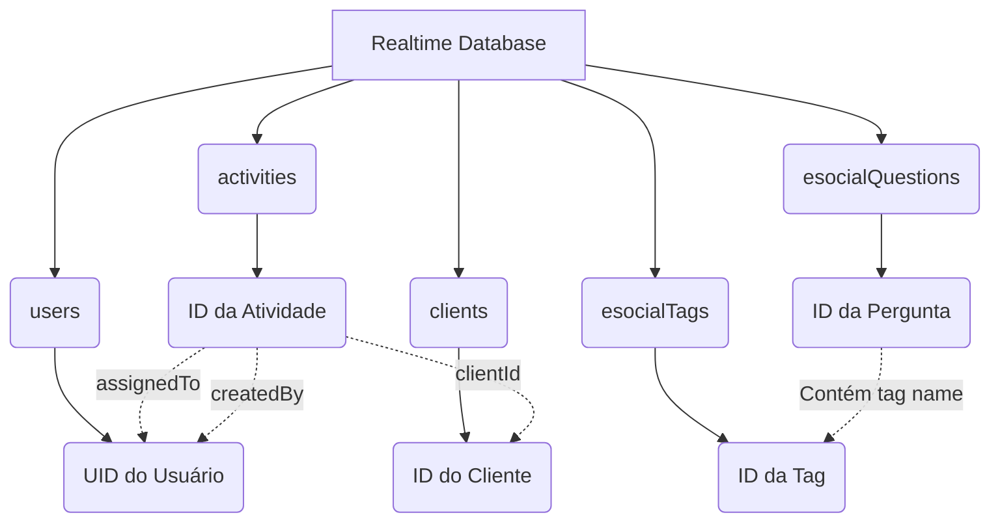

# 📊 Modelagem do Banco de Dados

O **Firebase Realtime Database** armazena os dados do projeto estruturados em um único documento JSON. A raiz do banco possui nós principais, correspondendo às entidades centrais da aplicação: `users` (colaboradores/usuários), `clients` (clientes), `activities` (atividades), `esocialQuestions` (perguntas e respostas do eSocial) e `esocialTags` (tags categorizadoras).

---

## 🏗️ Nós Principais

### 1. `users`
Armazena dados cadastrais e permissões dos colaboradores. A chave identificadora de cada nó é o UID gerado pelo *Firebase Authentication*.

*   **`users/[UID]`** (Objeto):
    *   `uid` (string): Identificador único do colaborador.
    *   `name` (string): Nome completo.
    *   `email` (string): Endereço de email.
    *   `cpf` (string): CPF formatado.
    *   `phone` (string): Telefone de contato.
    *   `birthDate` (string): Data de nascimento (`YYYY-MM-DD`).
    *   `admissionDate` (string): Data de admissão na empresa (`YYYY-MM-DD`).
    *   `role` (string): Nível de permissão (`admin` | `manager` | `collaborator`).
    *   `active` (boolean): Flag de controle de exclusão lógica (colaborador ativo/inativo).
    *   `status` (string, opcional): Status operacional (`active` | `inactive` | `pending`).
    *   `photoURL` (string, opcional): URL da imagem de perfil do usuário.
    *   `createdAt` (string): Data de criação em formato ISO 8601.
    *   `updatedAt` (string): Data de atualização em formato ISO 8601.
    *   `createdBy` (string): UID do usuário que efetuou o cadastro.

### 2. `clients`
Armazena dados de clientes do tipo Pessoa Física (PF) ou Pessoa Jurídica (PJ). A chave identificadora de cada nó é gerada automaticamente pelo Firebase.

*   **`clients/[ClientId]`** (Objeto):
    *   `id` (string): Identificador único do cliente.
    *   `name` (string): Nome completo (PF) ou Nome Fantasia (PJ).
    *   `type` (string): Tipo de cliente (`fisica` | `juridica`).
    *   `email` (string): E-mail para contato.
    *   `phone` (string): Telefone.
    *   `address` (string, opcional): Endereço completo.
    *   `notes` (string, opcional): Notas administrativas livres.
    *   `reportIntroduction` (string, opcional): Introdução textual personalizada gerada em seus relatórios DOCX.
    *   `active` (boolean): Flag de exclusão lógica (ativo/inativo).
    *   `createdAt` (string): Data de criação em formato ISO 8601.
    *   `updatedAt` (string): Data de atualização em formato ISO 8601.
    *   `createdBy` (string): UID do colaborador que efetuou o cadastro.
    *   **Campos Condicionais por Tipo:**
        *   *Se `type` for `fisica`:*
            *   `cpf` (string): CPF.
            *   `rg` (string, opcional): Registro Geral (RG).
        *   *Se `type` for `juridica`:*
            *   `companyName` (string): Razão Social da empresa.
            *   `cnpj` (string): CNPJ.
            *   `responsibleName` (string, opcional): Nome do contato responsável na empresa.

### 3. `activities`
Representa os registros de agendas, tarefas e atendimentos. A chave do nó é gerada dinamicamente pela API do Firebase.

*   **`activities/[ActivityId]`** (Objeto):
    *   `id` (string): Identificador único da atividade.
    *   `title` (string): Título breve da atividade.
    *   `description` (string): Descrição detalhada da atividade.
    *   `clientId` (string): ID de referência do nó do cliente (`clients/[ClientId]`).
    *   `assignedTo` (array de strings): Lista contendo UIDs de colaboradores atribuídos (`users/[UID]`).
    *   `status` (string): Status atual (`pending` | `in-progress` | `completed` | `cancelled`).
    *   `priority` (string): Nível de urgência (`low` | `medium` | `high`).
    *   `startDate` (string): Data e hora de início (ISO 8601).
    *   `endDate` (string): Data e hora prevista de conclusão (ISO 8601).
    *   `completedDate` (string, opcional): Data e hora real de conclusão (ISO 8601), preenchido apenas quando status for `completed`.
    *   `createdAt` (string): Data de criação (ISO 8601).
    *   `updatedAt` (string): Data de atualização (ISO 8601).
    *   `createdBy` (string): UID do colaborador que criou a atividade.
    *   `type` (string, opcional): Categoria da atividade (ex: Reunião, Suporte, Treinamento).

### 4. `esocialQuestions` (Módulo eSocial)
Armazena a base de dúvidas recorrentes relacionadas ao eSocial, para consulta rápida e enriquecimento de rotinas dos colaboradores.

*   **`esocialQuestions/[QuestionId]`** (Objeto):
    *   `id` (string): Identificador único da pergunta.
    *   `question` (string): Texto da pergunta/dúvida.
    *   `answer` (string): Resposta explicativa detalhada.
    *   `tags` (array de strings): Nomes das tags de categoria associadas (ex: `["S-2240", "LTCAT", "Insalubridade"]`).
    *   `createdAt` (string): Data de criação (ISO 8601).
    *   `updatedAt` (string): Data de atualização (ISO 8601).

### 5. `esocialTags` (Módulo eSocial)
Nó contendo a listagem das tags válidas utilizadas para indexação das perguntas do eSocial.

*   **`esocialTags/[TagId]`** (Objeto):
    *   `id` (string): Identificador único da tag.
    *   `name` (string): Nome textual normalizado (ex: `S-2220`).
    *   `createdAt` (string): Data de criação (ISO 8601).

---

## 🔗 Diagrama de Relacionamentos

